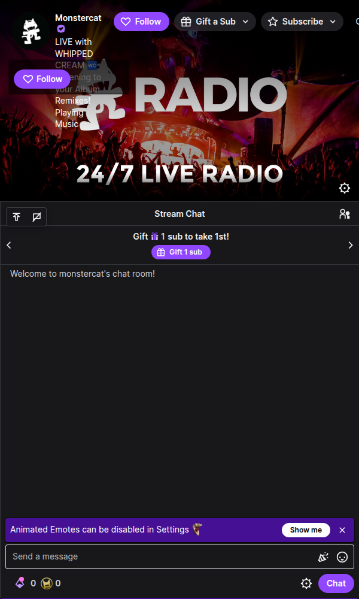
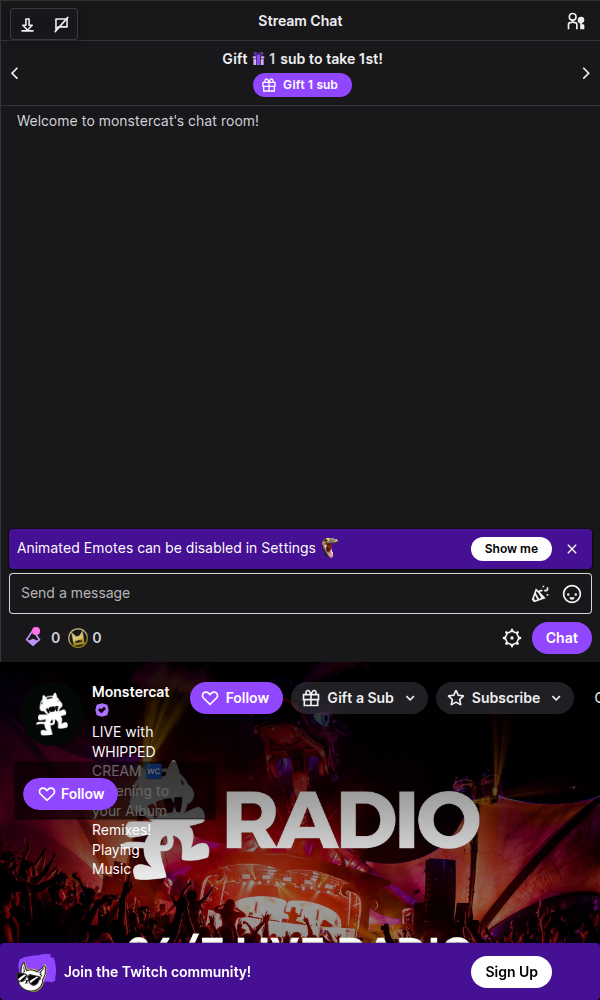
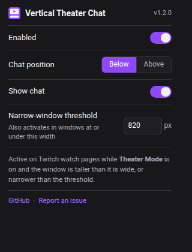

# Twitch Vertical Theater Chat

**Theater Mode that actually works in a vertical window: video on top, chat below.**

[](LICENSE)


Twitch's Theater Mode assumes a wide screen: video left, chat right. Put the
window on a portrait monitor, snap it to half of an ultrawide, or just make it
narrow, and chat collapses into a cramped sliver next to a shrunken player.
This extension detects that situation and rebuilds the layout the way a phone
app would: the player spans the full width at its natural 16:9 size, and chat
gets all the leftover vertical space.

It activates by itself and gets out of the way by itself, no clicking a mode
button, no broken fullscreen, no leftover styles when you widen the window.

<p align="center">
  
  &nbsp;
  
</p>

## Features

- **Automatic**: activates only when all three are true you're on a Twitch
  watch page, Theater Mode is on, and the window is portrait or narrower than
  the threshold (820 px by default). Widen the window or leave Theater Mode
  and Twitch's native layout returns untouched.
- **Full-width 16:9 player**: the video is never cropped or letterboxed; chat
  gets exactly the vertical space the player doesn't need.
- **Chat above or below**: floating controls on the page (and the toolbar
  popup) swap chat between top and bottom, or hide it to center the player.
- **Fullscreen-safe**: fullscreen requests are hooked in the page's main
  world, so the layout steps aside *before* fullscreen starts and Twitch's
  player controls and hover behavior stay intact.
- **SPA-aware**: Twitch never reloads the page while you browse; history
  hooks plus a scoped MutationObserver track channel switches and re-apply or
  tear down the layout as needed.
- **Native-chat aware**: if you collapsed chat with Twitch's own button, the
  vertical layout mirrors that instead of fighting it.
- **Synced settings**: on/off, chat position, chat visibility, and the width
  threshold live in `chrome.storage.sync` they survive clearing site data
  and follow your browser profile.
- **Private by design**: no analytics, no network requests, no host access
  beyond `twitch.tv`. See [PRIVACY.md](PRIVACY.md).

## How it works

Three small pieces, no build step, no dependencies:

| File | World | Job |
|---|---|---|
| `content.js` | isolated | State machine: decides *when* the layout applies, marks the player/chat DOM nodes with classes, computes heights into CSS variables, renders the floating controls |
| `styles.css` | page CSS | The entire layout, driven by `:root` classes + CSS variables set by `content.js` — declarative and trivially removable |
| `main-world.js` | MAIN | Hooks `requestFullscreen` and `history.pushState/replaceState` (which only exist meaningfully in the page's world) and relays them to `content.js` as DOM events |

Design choices worth stealing:

- **CSS variables as the API between JS and CSS.** JS computes four numbers
  (`--tvtc-player-top`, `--tvtc-player-height`, `--tvtc-chat-height`, chat
  position); CSS does everything else. Deactivating = removing one root class.
- **Never rebuild what you can observe.** Twitch's React app re-renders
  constantly; instead of racing it, a MutationObserver (with an ignore-filter
  for our own nodes and the chat firehose) schedules a single
  `requestAnimationFrame`-debounced update pass.
- **Intent windows instead of brittle event coupling.** Clicking the theater
  button, pressing Escape, and fullscreen transitions each set short-lived
  intent/suppression windows, then the next update pass verifies reality
  against Twitch's actual DOM state. Twitch UI changes degrade gracefully
  instead of breaking hard.

## Install

### Chrome Web Store

Not yet published, the repo is store-ready (`scripts/package.sh` builds the
upload zip, `docs/STORE_LISTING.md` has the complete listing copy). The link
will land here once it clears review.

### Manual (any Chromium browser)

Works in Chrome, Brave, Edge, Vivaldi, Opera, Arc (Chromium 112+):

1. Download the latest release zip (or clone this repo).
2. Open `chrome://extensions` (or your browser's equivalent).
3. Enable **Developer mode**.
4. Click **Load unpacked** and select the extension folder.
5. Open a Twitch stream, turn on Theater Mode, and make the window vertical
   or narrow.

Firefox is not supported (MAIN-world content scripts and the layout CSS rely
on Chromium behavior).

Verified compatible with **FrankerFaceZ** — FFZ's chat enhancements and player
buttons work normally inside the vertical layout. Twitch's own dialogs
(player settings, clip creation) open above the layout as usual.

## Settings



Click the toolbar icon:

| Setting | Default | Meaning |
|---|---|---|
| Enabled | on | Master switch; off restores Twitch instantly |
| Chat position | below | Chat under or above the video |
| Show chat | on | Hide to center the full-width player |
| Narrow-window threshold | 820 px | Landscape windows at or under this width also count as "vertical" |

The floating on-page buttons (top-left of the chat area) change the same
synced settings.

## Development

There is intentionally no build step the files you read are the files that
run. To hack on it:

```bash
git clone https://github.com/Pineacles/twitch-vertical-theater-chat
# load the folder as an unpacked extension, edit, hit ↻ on chrome://extensions
```

Package a store zip:

```bash
./scripts/package.sh   # writes dist/twitch-vertical-theater-chat-<version>.zip
```

## License

[MIT](LICENSE)
